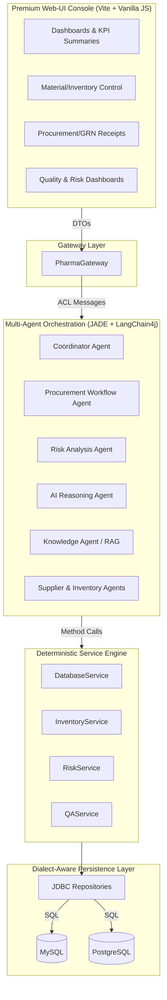
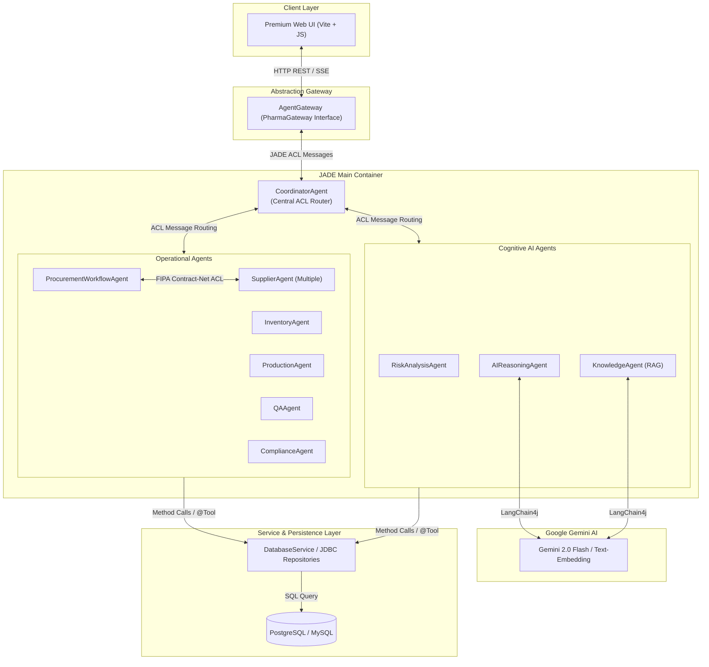
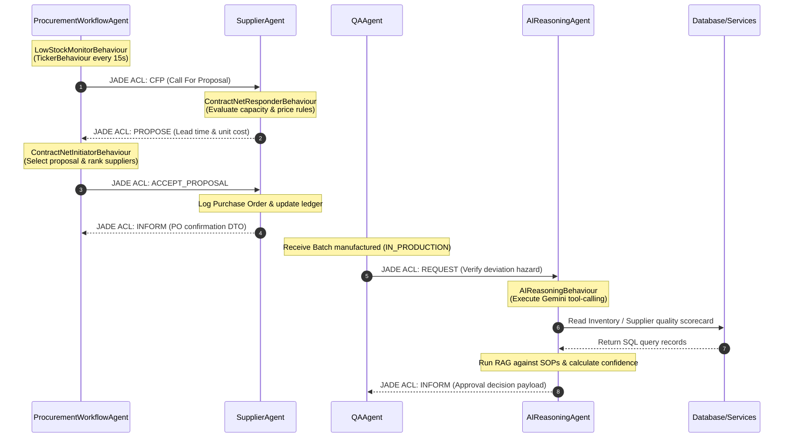

# Agentic Pharmaceutical Supply Chain Management System (v1.1)

[](https://www.oracle.com/java/)
[](https://maven.apache.org/)
[]()
[]()
[]()

An enterprise-grade, manufacturer-centric application that transitions a traditional monolithic architecture into a state-of-the-art **Multi-Agent Orchestrated System**. 

Version 1.1 focuses on a hybrid approach: **JADE (Java Agent Development Framework)** handles deterministic FIPA contract-net negotiations and distributed task coordination, while **LangChain4j** powered by Google's Gemini provides advanced cognitive capabilities, RAG (Retrieval-Augmented Generation), and complex reasoning.

---

## 👁️ System Overview & Paradigm Shift

The system manages upstream pharmaceutical manufacturing operations, enforcing strict regulatory compliance, complete batch lineage, automated supply chain routing, and proactive risk management.

### High-Level Architecture (v1.1)



### Key Upgrades in v1.1
1. **Dual Database Dialect Support:** A robust `JdbcSqlDialect` layer allows the application to run seamlessly on both **MySQL** and **PostgreSQL** without changing the Web UI Console or the underlying agents.
2. **God-Class Deconstruction:** The legacy massive `DatabaseService` has been systematically decomposed into domain-specific, dialect-aware JDBC repositories (e.g., `PurchaseOrderJdbcRepository`, `GRNJdbcRepository`).
3. **Advanced AI Integration:** Deep integration of Google's Gemini models via LangChain4j for risk analysis, supplier evaluations, and document-grounded standard operating procedure (SOP) queries.

---

## 🤖 The Multi-Agent Ecosystem

The application runs a specialized society of JADE agents, each with distinct responsibilities and behaviors.

### JADE Platform Container Architecture



### JADE Agent Communications, Actions, & Behaviors




| Agent Name | Primary Responsibility | AI / LLM Capabilities |
|------------|------------------------|------------------------|
| **CoordinatorAgent** | Main entry point for GUI requests. Routes messages via ACL to specialized agents. | None (Deterministic routing) |
| **ProcurementWorkflowAgent** | Monitors low stock and triggers FIPA Contract-Net protocols to automatically negotiate with suppliers and draft POs. | None (Deterministic negotiation) |
| **RiskAnalysisAgent** | Runs periodic sweeps of the supply chain to detect single-point-of-failure risks and supplier vulnerabilities. | Yes (Calls AIReasoningAgent for deep analysis) |
| **AIReasoningAgent** | The cognitive engine. Wrapped with LangChain4j tools. Evaluates complex scenarios (e.g., QA deviations) and outputs structured reasoning. | **Yes (Gemini LLM Tool Calling)** |
| **KnowledgeAgent** | Handles regulatory and SOP queries using a local vector store. | **Yes (RAG / Embeddings)** |
| **SupplierAgent** | Represents external suppliers. Evaluates CFPs (Call for Proposals) based on capacity and pricing. | None |
| **QAAgent** | Manages batch lineage, quality dispositions, and compliance blocking. | Yes (Delegates complex reviews to AI) |

---

## 🧠 AI & LangChain4j Integration (Phases 9-12)

The system leverages **LangChain4j (v1.16.1)** to provide cognitive capabilities to the JADE agents.

### 1. Tool Wrappers (`pharma.llm.tools`)
Existing deterministic Java services are exposed to the LLM via `@Tool` annotations. This allows the `AIReasoningAgent` to actively query the database to make decisions:
- `InventoryLlmTools`: Check stock levels and material availability.
- `SupplierLlmTools`: Rank suppliers and check capacity.
- `RiskLlmTools`: Score supplier and material stockout risks.

### 2. Retrieval-Augmented Generation (RAG)
The `KnowledgeAgent` uses `GoogleAiEmbeddingModel` to ingest local SOP documents (PDF/Text) into an `InMemoryEmbeddingStore`. When a user queries the system via the UI, the agent performs semantic search to provide highly accurate, cited answers regarding manufacturing protocols.

### 3. AI Decision Dashboard
A dedicated Web UI dashboard panel provides observability into the AI's autonomous decisions. Human supervisors can review the AI's confidence scores, read its "Agent Trace" (chain of thought), and manually approve or reject high-risk autonomous actions.

---

## 📂 Documentation Hub

All detailed technical documentation has been organized under the `doc/` directory:

*   **[ARCHITECTURE.md](doc/ARCHITECTURE.md)**: Deep dive into the architectural layers, package separation, transactional boundaries, and data flow.
*   **[AGENT_ARCHITECTURE.md](doc/AGENT_ARCHITECTURE.md)**: Specifications of all cooperative agents and communication schemas.
*   **[DATABASE_SCHEMA.md](doc/DATABASE_SCHEMA.md)**: Complete database relational schema description, index definitions, and audit trail tables.
*   **[WORKFLOWS.md](doc/WORKFLOWS.md)**: Step-by-step descriptions and Mermaid sequence diagrams for key processes.
*   **[CODING_STANDARDS.md](doc/CODING_STANDARDS.md)**: Development guidelines, naming conventions, and repository-service rules.

---

## 🛠️ Technology Stack

*   **Runtime Environment**: Java Development Kit (JDK) 21
*   **GUI Library**: Premium Web Console (Vite / Vanilla JS / Vanilla CSS / Light-Dark Themes)
*   **Database**: MySQL 8.0+ AND PostgreSQL 15+
*   **Connection Pool & Access**: HikariCP & Native JDBC (Dialect-Aware)
*   **Build & Dependency Management**: Apache Maven 3.9+
*   **Logging System**: SLF4J API with Logback implementation
*   **Agentic Frameworks**: JADE 4.6.0, LangChain4j (v1.16.1)
*   **LLM Provider**: Google Gemini (`gemini-1.5-pro` & `text-embedding-004`)

---

## ⚙️ Setup and Installation

### 1. Prerequisites
- **JDK 21** (Ensure `JAVA_HOME` is set up correctly)
- **Maven 3.9+**
- **MySQL Server 8+** OR **PostgreSQL 15+**

### 2. Database Initialization
You can run the application on either MySQL or PostgreSQL. Configure the `.env` file accordingly.

**For MySQL:**
```bash
mysql -u root -p < src/main/resources/database.sql
```

**For PostgreSQL:**
```bash
psql -U postgres -d pharma_ims -f src/main/resources/schema-postgres.sql
```

### 3. Environment Variables
Create a file named `.env` in the root folder of the project (`pharma-ims/`):
```ini
# Database Configuration (MySQL Example)
DB_PROFILE=mysql
DB_URL=jdbc:mysql://localhost:3306/pharma_ims
DB_USER=root
DB_PASS=yourpassword

# PostgreSQL Example
# DB_PROFILE=postgresql
# DB_URL=jdbc:postgresql://localhost:5432/pharma_ims
# DB_USER=postgres
# DB_PASS=yourpassword

# AI Configuration
GEMINI_API_KEY=your_google_ai_studio_key_here
GEMINI_MODEL=gemini-1.5-pro
GEMINI_TEMPERATURE=0.2
SOP_DOCUMENTS_PATH=./sop_documents/
```

### 4. Build and Compilation
Clean, resolve dependencies, and compile the application using Maven:
```cmd
mvn clean compile
```

### 5. Running the Application
Start the Javalin REST API backend and the JADE agent container:
```bash
mvn exec:java
```

Then, start the Vite Web UI development server in a separate terminal:
```bash
cd web-ui
npm install
npm run dev
```

---

## 🏗️ Architecture Rules & Compliance

To guarantee system stability, compliance, and transition safety, all code changes **must** respect the following boundary guidelines:

> [!IMPORTANT]
> **1. The Gateway Rule:** The UI must ONLY interact with the agents via the `PharmaGateway` interface. No direct service calls.
> **2. No JDBC in UI:** Swing ActionListeners must never contain raw SQL, connections, or JDBC statements.
> **3. No JDBC in Agents:** Agents are orchestration entities and must never contact the database directly.
> **4. Tool Wrapping:** AI Agents must delegate to deterministic `pharma.service` classes (via `@Tool` annotations) for validation and data mutations. Hallucinated data must never touch the database directly.
> **5. Repository Dialects:** All SQL must go through `pharma.repository.jdbc` classes utilizing the `JdbcSqlDialect` enum to ensure dual-database compatibility.
