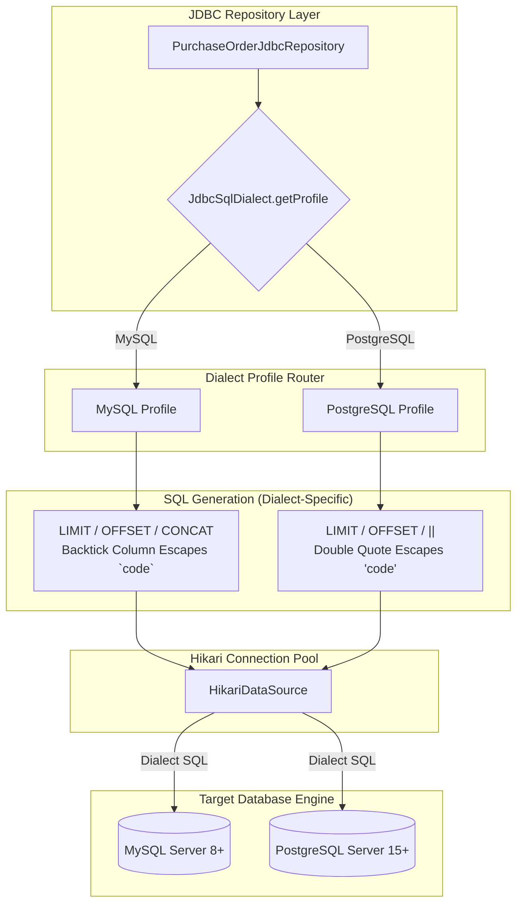
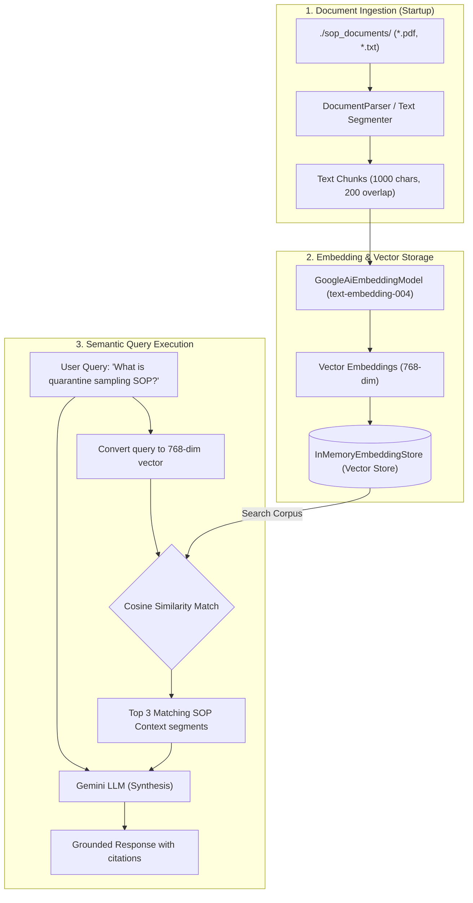
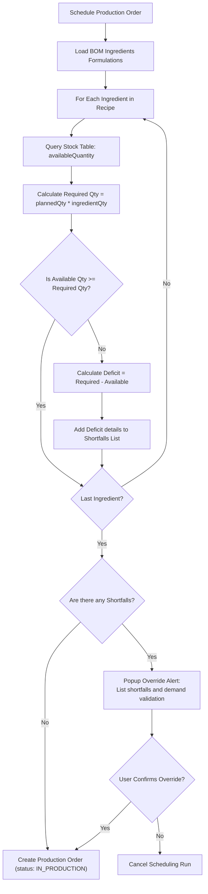

# Additional System Diagrams & Logic Flows

This document contains high-quality Mermaid diagrams detailing the dialect persistence router, tool-calling pipelines, RAG ingestion flows, and scheduling guards.

---

## 1. Dialect-Aware Persistence Flow

Illustrates how the JDBC Repository layer queries configuration profiles and generates database-compatible SQL dialects on the fly:



---

## 2. AI Tool-Calling (LangChain4j) Dataflow

Outlines the transaction flow when `AIReasoningAgent` leverages LangChain4j tool-calling wrappers to invoke deterministic Java queries:

```mermaid
sequenceDiagram
    autonumber
    participant Agent as AIReasoningAgent (JADE)
    participant Gemini as Google Gemini AI (LLM)
    participant JavaTools as LangChain4j Tool Wrapper
    participant Services as Deterministic Services (Java)
    participant Database as PostgreSQL / MySQL

    Agent->>Gemini: Prompt: "Rank suppliers for MAT-001 reorder"
    Note over Gemini: Analyzes prompt;<br/>Identifies requirement for supplier database check
    Gemini-->>Agent: Tool Request: call "SupplierLlmTools.rankSuppliers(MAT-001)"
    Agent->>JavaTools: Route tool call payload
    JavaTools->>Services: Invoke rankSuppliers("MAT-001")
    Services->>Database: SQL SELECT supplier performance ratings
    Database-->>Services: Return scores & capacity
    Services-->>JavaTools: Return list of ranked suppliers
    JavaTools-->>Agent: Format results as tool execution output
    Agent->>Gemini: Send tool results: "[Supplier A: Score 92%, Supplier B: Score 75%]"
    Note over Gemini: Evaluates tool outcomes & generates summary
    Gemini-->>Agent: Final Response: "Supplier A is recommended (92% rating)..."
```

---

## 3. RAG Document Ingestion & Search Pipeline

Details the startup document ingestion pipeline and similarity vector search queries run by the `KnowledgeAgent`:



---

## 4. Production Feasibility Sweep & Guard Logic

Illustrates the step-by-step validation logic run before scheduling production order runs:


