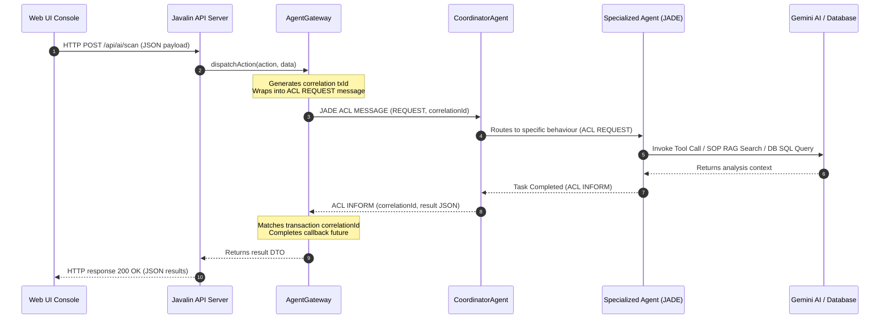

# Agentic Architecture (v1.1)

The Agentic Pharma SCM system (v1.1) employs a **hybrid Multi-Agent System (MAS)** architecture. It utilizes **JADE (Java Agent Development Framework)** as the underlying deterministic platform for messaging (FIPA ACL), lifecycle management, and behavioral execution, while integrating **LangChain4j (Gemini 1.5 Pro)** to provide cognitive capabilities, tool execution, and semantic search (RAG) to specific agents.

---

## 1. Core Platform & Communication

### JADE Container (`JadeContainerBootstrap.java`)
The system bootstraps a JADE Main Container on startup. All agents live within this container and communicate exclusively via ACL (Agent Communication Language) messages. 

### Gateway Layer (`PharmaGateway.java`)
The Java Swing UI is strictly forbidden from directly communicating with agents or the database. Instead, the UI submits requests to the `PharmaGateway` (implemented by `AgentGateway`), which serializes the payload, assigns a unique Correlation ID, and routes the message to the `CoordinatorAgent`.

---

## 2. Operational Agents

### 🛡️ Coordinator Agent
- **Role:** The primary entry point and orchestrator.
- **Function:** Receives all external requests from the Gateway. Identifies the intended action (e.g., `PROCUREMENT_WORKFLOW`, `RISK_ANALYSIS`) and forwards the request to the appropriate specialized agent. It acts as the central router to prevent tight coupling.

### 📦 Procurement Workflow Agent
- **Role:** Autonomous supply chain procurement.
- **Function:** Monitors the inventory for low stock materials using a `TickerBehaviour`. When a shortfall is detected, it acts as a **Contract-Net Initiator**, sending CFPs (Call for Proposals) to multiple `SupplierAgents`. It evaluates responses based on a composite score (price, lead time, capacity) and autonomously drafts Purchase Orders.

### 🏭 Supplier Agent
- **Role:** Digital twin of an external supplier.
- **Function:** Acts as a **Contract-Net Responder**. When it receives a CFP from the Procurement agent, it evaluates the supplier's real-time capacity and pricing rules, returning a structured proposal if capable.

### 📊 Inventory Agent
- **Role:** Warehouse and stock manager.
- **Function:** Handles localized inventory operations. Checks stock levels, reserves quantities during manufacturing or procurement workflows, and manages material consumption records.

### ⚙️ Production Agent
- **Role:** Manufacturing line coordinator.
- **Function:** Verifies Bill of Materials (BOM) availability, allocates resources, and tracks production order statuses (`IN_PRODUCTION` → `IN_PROCESS_SAMPLE` → `UNDER_TEST` → `APPROVED`).

### 🔬 QA Agent (Quality Assurance)
- **Role:** Quality disposition and batch tracking.
- **Function:** Manages quality statuses and test results. Can place batches into quarantine or reject them. Delegates complex deviation analyses to the `AIReasoningAgent`.

### ⚖️ Compliance Agent
- **Role:** Regulatory rule engine.
- **Function:** Validates manufacturing proposals and supplier licenses against hardcoded regulatory constraints to ensure absolute compliance before proceeding.

---

## 3. Cognitive & AI Agents (LangChain4j)

These agents break out of the deterministic JADE framework by leveraging LLMs to execute complex reasoning tasks.

### 🧠 AI Reasoning Agent
- **Role:** The centralized cognitive engine.
- **Function:** Equipped with `@Tool` wrappers mapped to existing Java services (`InventoryLlmTools`, `SupplierLlmTools`, `RiskLlmTools`, etc.). When a complex scenario arises (e.g., evaluating the impact of a QA deviation or assessing supplier risk), it uses the **Gemini 1.5 Pro** model to dynamically invoke tools, gather context from the database, and output a structured reasoning result with a confidence score.
- **Safeguard:** Any decision with a confidence score < 0.75 is flagged for Human-in-the-Loop (HITL) review in the AI Decision Dashboard.

### ⚠️ Risk Analysis Agent
- **Role:** Proactive supply chain threat detection.
- **Function:** Runs periodic background sweeps. Evaluates historical supplier performance, geopolitical risk, and single-source dependencies. It compiles these findings into `RiskReportDTOs`, utilizing the `AIReasoningAgent` to generate qualitative summaries of the risks.

### 📚 Knowledge Agent (RAG)
- **Role:** SOP and Regulatory expert.
- **Function:** Maintains a local `InMemoryEmbeddingStore` (vector database) loaded with Standard Operating Procedures (SOPs). Uses `GoogleAiEmbeddingModel` (`text-embedding-004`) to perform semantic search. When queried via the UI, it returns precise, cited answers grounded *only* in the ingested documents.

---

## 4. Agent Behaviors & Execution

Agents use specific JADE behaviors to manage concurrent execution:
- **`TickerBehaviour`**: Used for continuous monitoring (e.g., `LowStockMonitorBehaviour` checking stock every 15 seconds, `PeriodicRiskScanBehaviour` scanning daily).
- **`RequestHandlerBehaviour`**: A custom `CyclicBehaviour` that listens for ACL `REQUEST` messages, deserializes the generic payload, processes the task, and sends an `INFORM` response with the result.
- **`ContractNetInitiator/Responder`**: Used heavily in the Procurement workflow to handle multi-party negotiation without blocking the main agent thread.

## 5. Security & Hallucination Prevention
To prevent the LLM from executing destructive actions:
1. AI agents **cannot** generate raw SQL.
2. AI agents **cannot** bypass the service layer.
3. All AI actions are executed via strictly typed Java `@Tool` methods that contain built-in validation logic.
4. All AI decisions are logged immutably in the `ai_decisions` table for auditability.

---

## 6. High-Level Gateway & Multi-Agent Coordination

The following sequence diagram outlines how the modern HTTP Web Console bridges into the JADE agent container via the Java gateway layer:

### JADE Integration Instructions
1. **Correlation Tracking:** Every request dispatched from the Javalin web server to the JADE platform must include a unique transaction UUID.
2. **Non-blocking Callbacks:** Javalin API handlers must wait for JADE callbacks asynchronously using Java's `CompletableFuture` to avoid blocking main server threads.
3. **Fail-safe Fallbacks:** If the JADE container is stopped or offline, the gateway must fall back gracefully to a degraded mock mode to ensure API stability.
